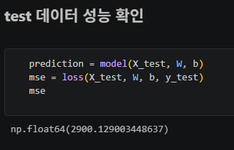
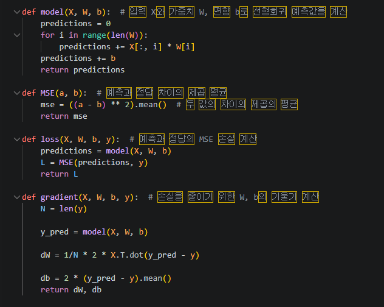
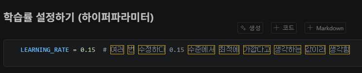
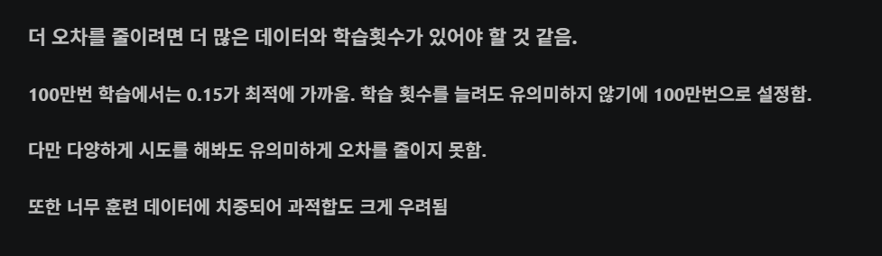

# AIFFEL Campus Online Code Peer Review Templete
- 코더 : 지승환
- 리뷰어 : 황인성


# PRT(Peer Review Template)
- [x]  **1. 주어진 문제를 해결하는 완성된 코드가 제출되었나요?**
    - 문제에서 요구하는 최종 결과물이 첨부되었는지 확인
        - 프로젝트 제출에 MSE 손실함수값 3000 이하를 달성 의 결과를 달성했습니다.
        - 
    
- [x]  **2. 전체 코드에서 가장 핵심적이거나 가장 복잡하고 이해하기 어려운 부분에 작성된 
주석 또는 doc string을 보고 해당 코드가 잘 이해되었나요?**
    - 해당 코드 블럭을 왜 핵심적이라고 생각하는지 확인
    - 해당 코드 블럭에 doc string/annotation이 달려 있는지 확인
    - 해당 코드의 기능, 존재 이유, 작동 원리 등을 기술했는지 확인
    - 주석을 보고 코드 이해가 잘 되었는지 확인
        - 각 함수가 무슨 역할을 하는지 옆에 주석처리로 잘 되어 있습니다. 나중에 볼 때를 대비해 각 라인에 주석이 있으면 좋겠습니다. 저도 그렇게 해야겠습니다.
        - 
        
- [x]  **3. 에러가 난 부분을 디버깅하여 문제를 해결한 기록을 남겼거나
새로운 시도 또는 추가 실험을 수행해봤나요?**
    - 문제 원인 및 해결 과정을 잘 기록하였는지 확인
    - 프로젝트 평가 기준에 더해 추가적으로 수행한 나만의 시도, 
    실험이 기록되어 있는지 확인
        - 여러번의 LEARNING_RATE 의 값을 수정하여 자신만의 최적의 값을 찾음
        - 
        
- [x]  **4. 회고를 잘 작성했나요?**
    - 주어진 문제를 해결하는 완성된 코드 내지 프로젝트 결과물에 대해
    배운점과 아쉬운점, 느낀점 등이 기록되어 있는지 확인
    - 전체 코드 실행 플로우를 그래프로 그려서 이해를 돕고 있는지 확인
        - 회고는 잘 작성 되어 있으며 그래프로 결과 값이 한 눈에 보기 좋게 되어 있습니다.
        - 
        
- [x]  **5. 코드가 간결하고 효율적인가요?**
    - 파이썬 스타일 가이드 (PEP8) 를 준수하였는지 확인
    - 코드 중복을 최소화하고 범용적으로 사용할 수 있도록 함수화/모듈화했는지 확인
        - 중요! 잘 작성되었다고 생각되는 부분을 캡쳐해 근거로 첨부


# 회고(참고 링크 및 코드 개선)
```
# 승환님의 리뷰를 보면서 제 리뷰가 많이 허전하다는 걸 느꼇습니다. 스스로 공부할 때 처럼 세세하게 적어야지 라고 다시 한번 생각이 들었습니다.
# 다른 사람의 코드를 보며 제가 만든 코드와 비교해 가면서 서로의 코드를 합치면 더 좋은 결과 값이 나오겠다. 라는 생각도 들었습니다.
# 지금은 이미 있는 예제에서 서로 각자의 방식으로 코드를 수정해 나갔지만 나중에 각자 만드는 코드는 제 3자의 입장에서 봤을 때 전혀 이해가 안될 수 있기 때문에 이번 코드 리뷰의 중요성을 알아 갔습니다.
# 서로의 방식이나 생각들을 알 수 있어서 정말 좋았습니다. 앞으로 알고 있는 코드들도 주석 처리로 쉽게 알 수 있게 해야 되겠다는 생각이 들었습니다.
```

